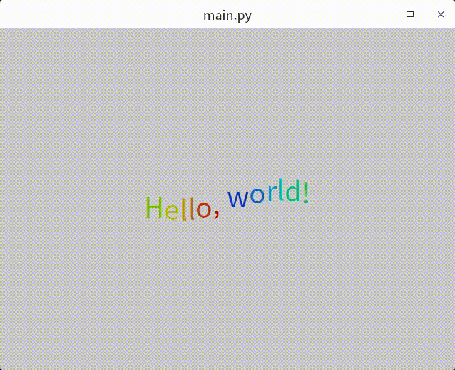

# Binding Custom QWidget with Shiboken2


## Instructions

### 依赖安装

安装`PySide2、shiboken2、shiboken2_generator`：

```shell
python3 -m pip install \
    --index-url=http://download.qt.io/official_releases/QtForPython/ \
    --trusted-host download.qt.io \
    shiboken2 pyside2 shiboken2_generator
```

查看安装的`PySide2`版本：

```shell
$ python3 -m pip list | grep PySide2
PySide2                       5.15.2
```


安装对应版本的[`Qt5`](https://www.qt.io/download)到`$HOME/Qt`目录。

```shell
wget https://d13lb3tujbc8s0.cloudfront.net/onlineinstallers/qt-unified-linux-x64-4.2.0-online.run
chmod +x ./qt-unified-linux-x64-4.2.0-online.run
./qt-unified-linux-x64-4.2.0-online.run
```


安装[libclang10.0](https://download.qt.io/development_releases/prebuilt/libclang/)。

```shell
wget https://download.qt.io/development_releases/prebuilt/libclang/libclang-release_100-based-linux-Ubuntu18.04-gcc9.2-x86_64.7z
sudo apt install p7zip
7z x libclang-release_100-based-linux-Ubuntu18.04-gcc9.2-x86_64.7z -o$HOME/
```


### 编译

运行工程根目录下的 `AutoBuild.sh`，如果`Qt5`的安装目录不是 `$HOME/Qt`，对该脚本进行修改。

```shell
./AutoBuild.sh
```


### 测试

运行`Test.sh`脚本。

```shell
./Test.sh
```

结果如图：

